--- 
title: "Aplicações práticas do software R para Agronomia"
author: "Gabriel Danilo Shimizu"
date: "`r Sys.Date()`"
site: bookdown::bookdown_site
documentclass: book
biblio-style: apalike
link-citations: yes
description: "Este é um livro virtual desenvolvido com a finalidade de fornecer tutoriais práticos das principais análises estatísticas e apresentação de dados utilizando o software R"
---

# Apresentação

O aumento quase exponencial da utilização do software R nas mais diversas áreas do conhecimento se deve principalmente a criação de pacotes. Os pacotes podem ser definidos como funções genéricas simples criadas em linguagem R e que procura simplificar um grande número de comandos em poucas linhas e argumentos.

Atualmente, o CRAN, principal repositório do R, possui mais de 15000 pacotes. Além dele, temos o bioconductor e o github, além de pacotes de uso interno das instituições.

Qualquer função pode ser implementada na forma de pacote, entretanto, a disponibilidade do mesmo para a comunidade científica no repositório CRAN por exemplo, requer uma série de etapas de avaliação.

Meu tutorial de criação do pacote não tem foco na publicação no repositório CRAN ou bioconductor. Não necessariamente reflete em como os usuários de R fazem, esta é forma como eu faço. 

# Ambiente R

Na minha busca pela criação de pacote em R, observei vários tutoriais e formas de fazer. Entretanto, a criação por projeto é o mais simples e fácil de manipular. Sendo assim, a forma que eu faço e irei apresentar é essa.

Antes de começar, solicito a instalação de dois pacotes: `roxygen2` e `devtools`

O ambiente do Rstudio engloba quatro janelas gráficas. 

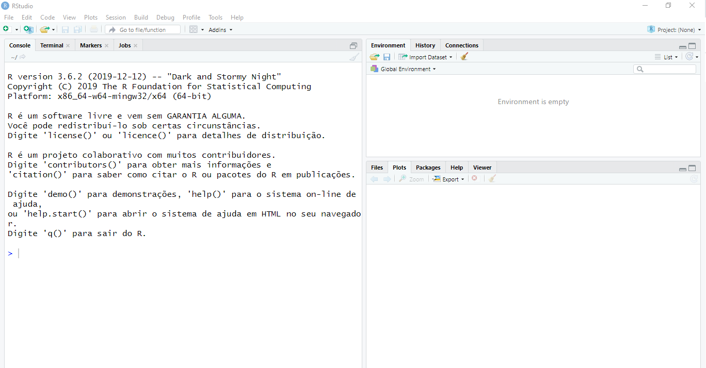

Para trabalhar no modo projeto, você precisa clicar no canto superior direito no icone "Project (None)", conforme figura abaixo.

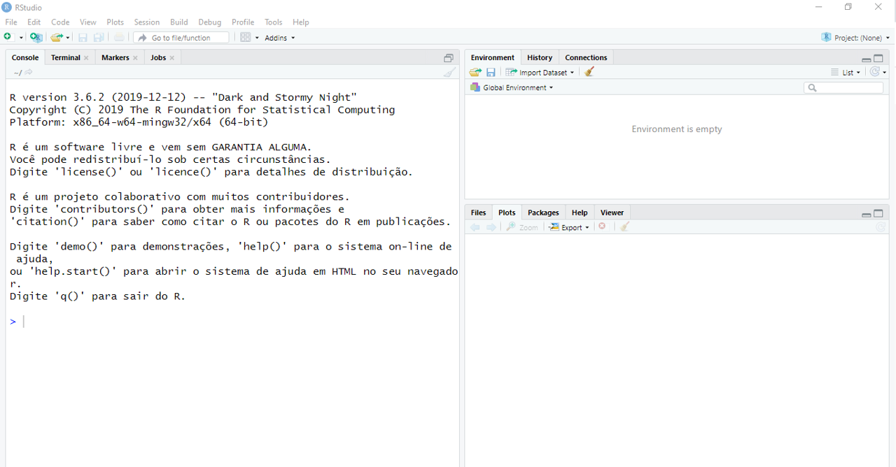

Após clicar no ícone, ir em "New Project"

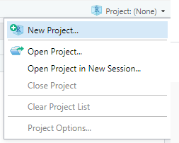

Por costume, não uso um diretório existente, assim, ir em "New Directory".

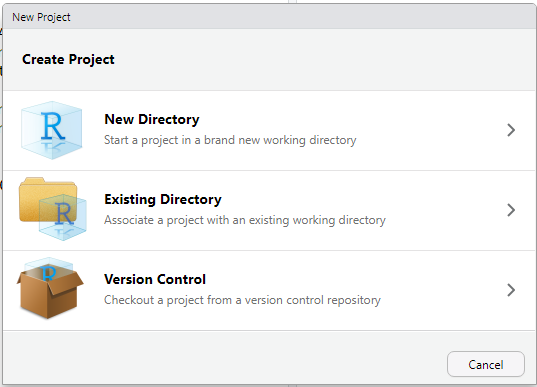

Os diretórios de projetos podem ser de diferentes tipos. No nosso caso, o projeto é do tipo "R Package". 

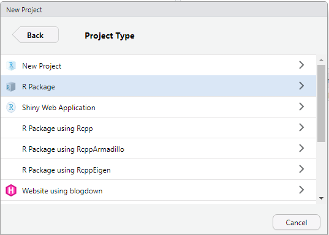

Após clicar no projeto do tipo R package, você deve nomear o pacote. No meu caso, estou chamando de "Curso".

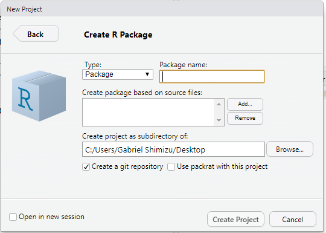

A criar o projeto, o próprio R irá criar diversos artigos no repositório. Esses arquivos são necessários para o funcionamento do pacote.

Por default, o R cria um arquivo de extensão .R chamado "Hello.R", que dá dicas de como trabalhar nesse ambiente.

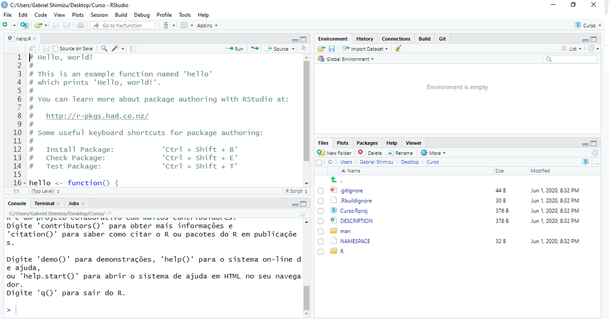

## Significado dos arquivos

 - DESCRIPTION: arquivo de descrição do pacote
 - NAMESPACE: arquivo de importação e exportação de funções
 - pasta man: pasta com a descrição das funções do pacote (Help do R)
 - pasta R: pasta com as funções (No arquivo .R deve constar também a descrição da função dentro)

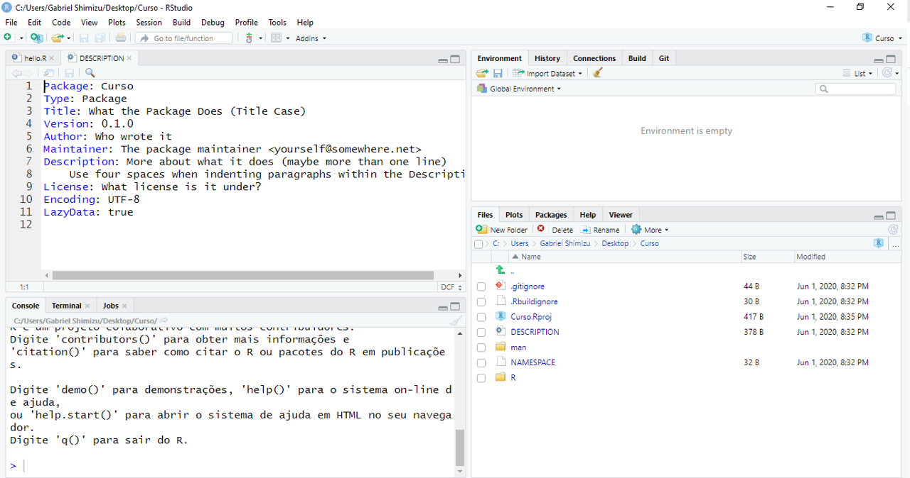
 
Alguns pacotes do R podem ter várias outras pastas e arquivos. Isso depende a forma como estamos programando.

# Configurando o Rstudio

Uma das configurações que é necessária para facilitar a documentação do pacote e configurando o Rstudio para criar os arquivos .Rd da pasta man através do pacote roxygen2

Ir em "tools"

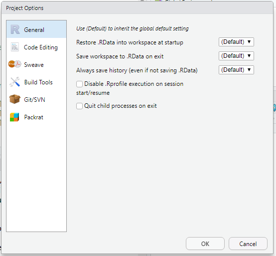

Ir em Build tools

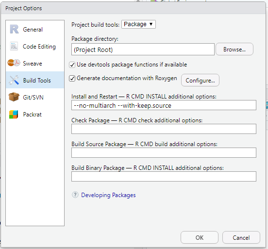

Marcar a opção Install and Restart

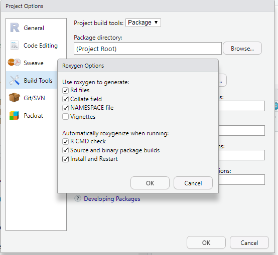

# Criando uma função

A forma como criar funções depende muito da habilidade, experiência e criatividade do usuário. 

Vejamos um exemplo:

As quatro primeiras linhas abaixo é um exemplo da documentação do pacote no Help, sendo que o mesmo será transcrito através do roxygen2 para um arquivo .Rd. É somente um exemplo curto, a documentação completa necessita de vários itens. Devo ressaltar que palavras acentuadas e caracteres especiais têm problema na hora da criação do pacote. Assim, sugiro remover todas.

Criei uma função simples, com dois argumentos (trat e dados) e dentro dela coloquei outras funções, como o `aov`, `shapiro.test`, `bartlett`

```{r, eval=FALSE}
#' @author Gabriel Danilo Shimizu
#' @description meu primeiro pacote
#' @param dados vetor de dados
#' @param trat vetor de tratamento

minhafuncao=function(dados,trat){
  mod=aov(dados~trat)
  print(anova(mod))
  print(shapiro.test(mod$residuals))
  print(bartlett.test(mod$residuals~trat))
}
```

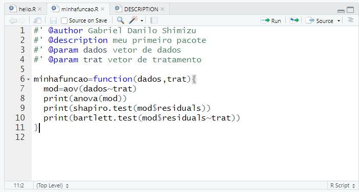

# Adicionando pacote dependentes

